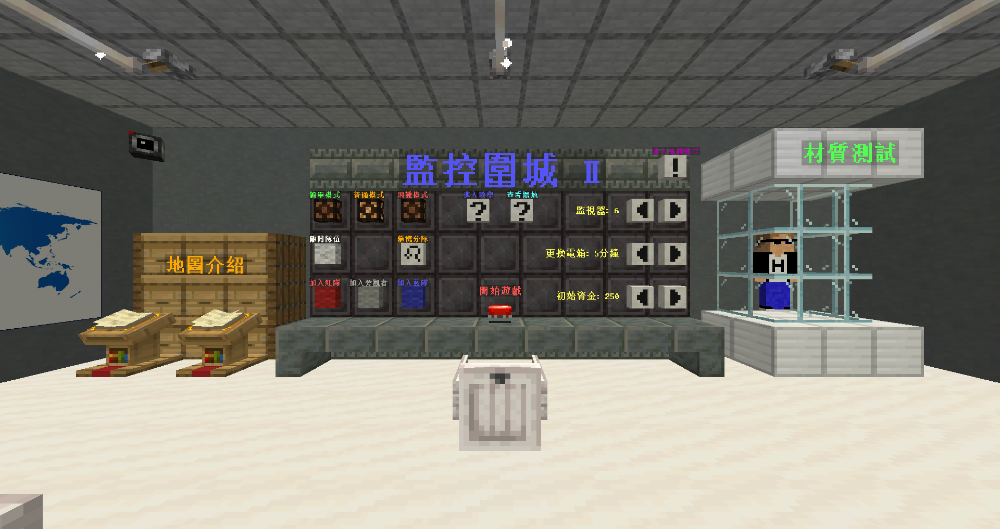

# 監控圍城2

- 地圖名稱：監控圍城 II
- 地圖類型：多人對戰
- 遊戲版本：1.21.5
- 建議人數：6~12人
- 遊玩時間：一小時

## 🎮 遊戲介紹
玩家將分為兩個陣營：<span style="color:crimson">求生者</span>與<span style="color:royalblue">監控者</span>。<br>
一場遊戲共分為 **上下兩回合**，下半場雙方 **交換陣營**。

- <span style="color:crimson">求生者</span>**目標**：利用手中的物資與武器存活 **25分鐘**，同時擊退怪物與應對各種危機。<br>
- <span style="color:royalblue">監控者</span>**目標**：部署陷阱、召喚怪物，想盡辦法讓求生者倒地或死亡。<br>

每位求生者都擁有貢獻分數，計分方式如下：
- 倒地：監控者 +50分
- 死亡：監控者 +70分
- 擊殺怪物：監控者 -1分
- 遊戲結束時，求生者所承受的總傷害將加成並換算為分數（傷害量×5%）

遊戲結束時，總分較高的隊伍獲得勝利。

🔺 遊戲時間線

## 📦 準備階段
遊戲一開始有 **3分鐘** 準備時間，雙方要在準備時間內完成以下事項：<br>
<span style="color:crimson">求生者</span>：前往商店購買裝備或探索地圖熟悉地形。每種槍枝僅能各購買一把。準備階段結束後，商店將永久關閉。<br>
<span style="color:royalblue">監控者</span>：安裝六台監視器。點擊對話框中的安裝按鈕，即可在當前位置放置監視器，安裝後便無法更改位置。準備階段結束後，將無法安裝監視器。

## 🔵 監控者
### 🔧 發電
在監控方，**電力** 是關鍵資源，最大儲存上限為 **300**。<br>
監控者擁有三台 **發電機**，可消耗電力升級，共分為 **三個等級**。等級越高，發電所產出的電力越多。<br>
可選擇消耗 **130電力** 升級為 **全自動發電機**，無需人工操作也能穩定產出電力。

⚠️ 注意：在發電過程中，發電機有機率發生故障。監控者可 **手動修復**，或消耗 **50電力** 自動修復。

### 📹 監視器
遊戲開始後，監控者可透過 **監視器** 即時查看求生者的行動。**任意移動** 即可退出監視器畫面。<br>
使用監視器會持續消耗 **電力**，耗盡後將暫時無法使用。<br>
長時間使用會導致過熱並冒煙，多人同時使用會大幅升溫。閒置時會逐漸冷卻。<br>
過熱冒煙狀態共分為 **三個等級**，若超越 **三級冒煙**，該台監視器將會 **爆炸**，直到遊戲結束都無法再次使用。

⚠️ 注意：監視器共有 **三個等級**，可消耗電力進行升級。等級越高，監視器消耗的電力越少，可承受的過熱時間越長，發生爆炸的風險越低。
| 等級 | 升級所需 | 消耗電力 | 一級冒煙 | 二級冒煙 | 三級冒煙 | 爆炸 |
| - | - | - | - | - | - | - |
| 1 | 預設 | 5秒/電力 | 0.5分鐘 | 1分鐘 | 1.5分鐘 | 2分鐘 |
| 2 | 30電力 | 10秒/電力 | 1分鐘 | 2分鐘 | 3分鐘 | 4分鐘 |
| 3 | 60電力 | 15秒/電力 | 2分鐘 | 3分鐘 | 4分鐘 | 5分鐘 |

🔺 監視器等級

### 🧟 怪物召喚
監控者可召喚 **七種怪物**，依難度分為：三種簡單怪物、兩種普通怪物、兩種困難怪物。<br>
雙方會獲得相同的怪物。若對當前的怪物不滿意，可花費 **20電力** 刷新一種怪物。<br>
遊戲開始時會解鎖前三種怪物，之後每經過 **5分鐘**，將依序解鎖一種新的怪物。<br>
玩家可選擇召喚的怪物數量。召喚後會進入 **冷卻時間**，召喚數量越多，冷卻時間越長。<br>
召喚方式分為兩種：<br>
- **自動召喚**：怪物將會隨機出現在求生者周圍地區，無需手動操作。
- **手動召喚**：監控者可透過監視器畫面，右鍵點擊指定位置召喚怪物。每召喚一隻怪物將消耗 2電力。

⚠️ 注意：每 **40秒** 會在求生者周圍 **自然生成怪物**。

### 🧪 收容生物
監控者擁有 **五種收容生物**：村民、殭屍、骷髏、蜘蛛、苦力怕。<br>
每個生物擁有三項狀態：體溫、飽食度、血量<br>
若體溫或飽食度過高或過低，都會導致 **血量** 下降。玩家需透過 調節室內溫度 與 餵食 來維持牠們的穩定狀態。<br>
若生物血量降至 0 則會 **死亡**。可消耗 **30電力** 將其復活。<br>
若選擇 **凍結生物**，生物狀態將不會產生變化，但也會停止生產材料。<br>
在遊戲過程中，生物有機率逃離收容櫃。若未將其重新關回收容櫃中，將無法獲得材料資源。<br>
生物每 **1分鐘** 會自動產出對應的 **材料**，收集到的材料可用來購買各式陷阱。<br>
監控者可透過 **監視器** 投放陷阱至地圖上的指定位置，以阻擋或牽制求生者。<br>

### ⚙️ 機關
遊戲中設有 **六種機關**，可透過消耗 **電力** 來啟動，對求生者造成干擾或限制。<br>
可用機關如下：
- 關閉電箱：消耗 50電力
- 鐵門上鎖：消耗 50電力
- 釋放酸雨：消耗 60電力
- 釋放毒氣：消耗 70電力
- 禁止奔跑：消耗 80電力
- 更換電箱：消耗 80電力

啟動機關後將會進入 **冷卻時間**，在冷卻期間內將無法再次使用。

### 🧬 人體變型
人體變型功能可消耗 **50電力**，讓監控者暫時化身為怪物，進行直接干擾與攻擊。<br>
成功變型後，玩家將會被傳送至求生者的聚集區域。每隻變型怪物皆擁有兩個 **主動技能** 和一個 **被動技能**。

⚠️ 注意：在遊戲最後 **5分鐘**，人體變型裝置將 **免費開放**，所有監控者皆可無限制變型。

## 🔴 求生者
### 🧍‍♂️ 裝備武器
遊戲開始時，所有求生者將獲得一套皮革裝備。<br>
求生者可透過強化台升級武器與防具。強化需消耗 **經驗值**，可透過擊殺怪物獲得。<br>
商店中提供五種 **近戰武器** 選購，每種武器具備不同攻擊傷害與攻擊速度。<br>
⚠️ 注意：武器的攻擊力會隨著耐久度下降而降低。副手拿著武器，主手拿著 **磨刀石**，按著右鍵即可進行修復。<br>
**建議購買物品**：
- 近戰武器×1
- 手槍-彈夾×10~15
- 散彈槍-子彈×50~80
- 衝鋒槍-彈夾×20~30
- 磨刀石×3~5
- 牛排×30~50
- 止痛藥×7~10
- 夾板×1~3

### 🩹 倒地
當求生者的血量耗盡時，會進入倒地狀態，需等待隊友救援，並增加監控者 **50分**。<br>
其他求生者可在倒地隊友旁長按蹲下鍵進行救援。<br>
被救援成功後，求生者將獲得 **10秒** 回復 II 和 抗性 V 效果。<br>
若 **60秒內** 無人救援，該求生者將會死亡，後在原地重生，並增加監控者 **70分**。<br>
死亡重生後，求生者將獲得 **30秒** 力量 I 和 抗性 V 效果。

### ⚡ 電箱
地圖中設有電箱，內含 **八種功能**，可消耗經驗值為求生者提供關鍵支援。<br>
- 水管爆裂
- 電力破壞
- 禁止監控
- 轉移怪物
- 鐵門解鎖
- 雙倍血量
- 立即救援
- 範圍清怪

電箱位置 會在遊戲過程中不定時變更，需隨時留意地圖上的更新資訊。<br>
若電箱被監控者關閉，需修復後才能再次使用。<br>
反覆點擊空白鍵進行修復。過程中將觸發 快速反應事件（QTE），玩家需在限時內按下指定按鍵。若 QTE 失敗，則修復進度倒退。

### 🦴 骨折
當求生者從高處跌落時，將會獲得 永久性 **緩速 III** 效果，影響移動速度。<br>
骨折可透過使用夾板進行治療，成功治療後將消除消除緩速 III 效果。

### 🐻 捕獸夾
捕獸夾是一種陷阱，能有效限制敵方行動。<br>
當 **怪物** 踩到捕獸夾時，將會被固定在原地 **8秒**，無法移動。<br>
當 **玩家** 踩到捕獸夾時，將會被固定在原地。被捕獸夾困住的玩家，可反覆點擊跳躍鍵進行掙脫操作。

### 🚪 窗戶和門
在遊戲中，所有怪物皆可破壞窗戶與開門。<br>
求生者可前往商店購買 **錘子** 與 **木板** ，用來加固窗戶。完成加固後，該窗戶將無法被怪物破壞。<br>
在遊戲中，監控者可能會鎖上所有門。求生者可使用 **開鎖器** 解鎖。在鐵門旁手持開鎖器點擊右鍵，接著持續上下滾動滑鼠滾輪，進行解鎖操作。完成解鎖後，該鐵門將會轉換為木門。

## 💀 怪物
殭屍<br>
等級：低<br>
特點：
- 移動速度快
- 較弱的視力 
- 以量取勝

苦力怕<br>
等級：低<br>
特點：
- 移動速度慢
- 血量高
- 爆炸時間長

骷髏<br>
等級：低<br>
特點：
- 使用弓箭
- 移動速度快
- 較強的視力

史萊姆<br>
等級：低<br>
特點：
- 移動速度慢
- 死後會分裂
- 被打到會緩速

河豚<br>
等級：低<br>
特點：
- 尖刺效果
- 被打到會中毒
- 容易被擊退

豬<br>
等級：低<br>
特點：
- 強大的擊退力
- 血量高
- 不易被擊退

狼<br>
等級：低<br>
特點：
- 血量低
- 死後會化為狼人
- 狼人攻擊力提高

熾足獸<br>
等級：低<br>
特點：
- 移動速度快
- 靠近的玩家會中毒
- 死後會放火

終界使者<br>
等級：低<br>
特點：
- 移動速度快
- 受傷會瞬移
- 被打到會轉動視角

深海守衛<br>
等級：中<br>
特點：
- 雷射攻擊
- 尖刺效果
- 有腳行走

衛道士<br>
等級：中<br>
特點：
- 移動速度快
- 攻擊力高
- 破窗時不受木板影響

鐵魔像<br>
等級：中<br>
特點：
- 移動速度慢
- 血量高
- 被打到會被擊飛

女巫<br>
等級：中<br>
特點：
- 藥水攻擊
- 血量高
- 靠近的玩家會虛弱

蜘蛛<br>
等級：中<br>
特點：
- 會爬墻
- 受傷會召喚洞穴蜘蛛
- 被打到會被蜘蛛網纏著

烈焰使者<br>
等級：高<br>
特點：
- 使用火焰弓箭
- 無法預測的飛行
- 攻擊力高

喚魔者<br>
等級：高<br>
特點：
- 擁有不死圖騰
- 召喚惱鬼
- 召喚尖牙

凋零骷髏<br>
等級：高<br>
特點：
- 兩格高
- 被打到會凋零
- 死後會滯留凋零效果

## 🔻 下載
地圖（神社）：[點我](https://drive.usercontent.google.com/u/0/uc?id=1DqR3tsgh_-jNF-rmaVfak_eM0GCqpWWS&export=download)<br>
地圖（西部）：[點我](https://drive.usercontent.google.com/uc?id=1oNzBnzscrVx4qHQV8inO0MsBpaTLteQ8&export=download)<br>
地圖（木屋）：[點我](https://drive.usercontent.google.com/uc?id=1jW6G8e5YEAKtbEWuGyKpzX2-UzZZ7Ga2&export=download)<br>
地圖（村莊）：[點我](https://drive.usercontent.google.com/uc?id=1RaTu334eztXtaqfRhyxq4nrLrsTsWjwv&export=download)<br>
資源包：[點我](https://drive.usercontent.google.com/uc?id=10tvdQ2MIlbwX_xjLDN8GU0ItzRSVXRPu&export=download)

## 🎨 資源包
本地圖提供 **專屬資源包**。強烈建議安裝以獲得更好的遊戲體驗。<br>
可搭配其他的資源包遊玩。<br>
若想讓伺服器的玩家自動安裝資源包，可在server.properties做出以下設定：
```
require-resource-pack=true
resource-pack=https://drive.usercontent.google.com/uc?id=10tvdQ2MIlbwX_xjLDN8GU0ItzRSVXRPu&export=download
```

## 🧑‍🤝‍🧑 製作人員
企劃：惡靈<br>
指令：惡靈、AC<br>
材質：惡靈、姆咪<br>
建築：惡靈、杏奈、姆咪、AC、狗燈、無尾熊、玫瑰、野路、五百、檸檬、愛蘿喵、香榭